# 가상 공정 AX Project — 설비 예지보전 & AI 비전

> **볼트·너트 라인 스마트팩토리 예지보전(PdM) · 안전 인터록 시스템 v2**
> 핵심 메시지: **"불량이 나기 전에 AI가 먼저 라인을 세운다"**


볼트·너트 생산 라인(1호기 압조 → 2호기 전조 → 3호기 열처리 → 4호기 컨베이어)에 **실측 판정 + AI 5분 선행 예측 + 비전 검사**를 붙이고, 세 곳에서 오는 정지 요청을 **Rust 인터록 허브 하나**가 받아 4호기 컨베이어를 안전하게 정지·퇴출시키는 시스템입니다.

---

## 목차

1. [주요 성과](#1-주요-성과)
2. [개발 환경과 기술 스택](#2-개발-환경과-기술-스택)
3. [초기 시스템의 문제점과 개선](#3-초기-시스템의-문제점과-개선)
4. [시스템 아키텍처](#4-시스템-아키텍처)
5. [데이터 수집: 센서 → 미들웨어](#5-데이터-수집-센서--미들웨어)
6. [안전 인터록: Rust 허브와 4호기](#6-안전-인터록-rust-허브와-4호기)
7. [불량 판정 기준표](#7-불량-판정-기준표)
8. [AI 예지보전 엔진](#8-ai-예지보전-엔진)
9. [AI 비전 검사](#9-ai-비전-검사)
10. [데이터베이스](#10-데이터베이스)
11. [동작 시나리오와 장애 대응](#11-동작-시나리오와-장애-대응)
12. [대시보드와 네트워크](#12-대시보드와-네트워크)
13. [폴더 구조와 실행 방법](#13-폴더-구조와-실행-방법)
14. [알려진 한계와 다음 단계](#14-알려진-한계와-다음-단계)
15. [참고](#15-참고)

---

## 1. 주요 성과

| 요구사항 | 구현 | 결과 |
|---|---|---|
| 코드는 판정 기준표와 일치 | 기준값을 C++·Python 두 곳에만 정의, 부등호까지 기준표 그대로 | **9개 판정 조건 1:1** |
| 현실적인 가상 센서, 서서히 진행되는 불량 | 물리 기반 열화 8종, 진행 속도 ±30% 변동 | 정비 전까지 회복 없음 |
| 빠짐없는 수집과 저장 | 일련번호 + 체크섬, 전용 저장 스레드 | **117만 샘플 누락 0** |
| 현장에서 믿을 수 있는 AI 예측 | 분위수 LSTM, 불확실하면 정지 안 함 | **21건 중 20건 선행 (중앙값 2.6분)** |
| 불량 예측 시 4호기 라인 정지 (Rust) | Rust 인터록 허브, ACK·재전송·워치독 | **응답 지연 1ms 미만** |
| 오경보 없는 운영 | 신뢰성 관문 5개 + P50±3σ 15초 연속 조건 | **정상 운전 8시간 오경보 0건** |

---

## 2. 개발 환경과 기술 스택

### 개발 환경

| 구분 | 내용 |
|---|---|
| 운영체제 | Windows 11 (호스트) + **WSL2 Ubuntu 24.04 LTS** (모든 프로그램 실행) |
| USB 연결 | **usbipd-win** — 아두이노 4대·카메라를 WSL2로 전달 |
| 하드웨어 | Arduino UNO R4 Minima × 4 (1~3호기 가상 센서, 4호기 컨베이어 제어) |
| 카메라 | Intel RealSense D435 (컬러 640×480) |
| 가속기 | Intel Arc GPU (OpenVINO 비전 추론) |
| 도구 | VS Code + Remote-WSL, Arduino IDE, CMake 3.25+, uv |
| AI 개발 보조 | Claude (Anthropic) · Gemini (Google) |

### 사용 언어와 오픈소스

| 구성 요소 | 언어 | 주요 오픈소스 | 라이선스 |
|---|---|---|---|
| 가상 센서 펌웨어 | Arduino C++ | Arduino UNO R4 (Renesas) 코어 | LGPL |
| 미들웨어 | C++ (GCC 13) | SQLite 3.45 | Public Domain |
| 인터록 허브 | Rust 1.80+ | serialport · serde · rusqlite · ctrlc | MPL-2.0 · MIT/Apache-2.0 |
| AI 엔진 | Python 3.12 | PyTorch · NumPy | BSD-3 |
| 대시보드 | Python · JavaScript | Python 표준 라이브러리 · Chart.js 4.4.1 | PSF · MIT |
| 비전 엔진 | C++17 | OpenVINO · OpenCV · ONNX Runtime | Apache-2.0 · MIT |
| 비전 모델 | Python | Ultralytics YOLO11n-cls · anomalib PatchCore | AGPL-3.0 · Apache-2.0 |
| 연동·운영 스크립트 | Python · Bash | 표준 라이브러리 · socat (시뮬레이터) | PSF · GPL-2.0 |

> **역할별 언어 분리**: 실시간 수집은 **C++**, 안전 인터록은 **Rust**, AI·연동은 **Python**.

---

## 3. 초기 시스템의 문제점과 개선

### 초기(v1) 문제점

| 영역 | 초기 문제 | 영향 |
|---|---|---|
| 센서 | 1호기 진동이 잡음 없는 고정 파형 | 값이 항상 같음 → AI 학습 불가 |
| 센서 | 불량이 5초간 갑자기 생겼다 사라짐 | 서서히 진행되는 실제 고장과 다름 |
| 판정 | 진동 지표가 RMS가 아닌 최대 진폭 | 기준 0.8에 도달 불가 |
| 판정 | 경계 조건 불일치 (AI `≥`, C++ `>`) | 같은 값을 다르게 판정 |
| 수집 | 누락·손상을 셀 방법 없음 | '빠짐없이'를 증명 불가 |
| 인터록 | **AI 불량 예측이 화면 출력뿐** | **라인이 서지 않음** |
| AI | '5분 예측'이 실제로는 몇 초 뒤 예측 | 미리 잡을 수 없음 |
| AI | 출력 제약 없음 | 음수 진동값 예측 |
| 코드 | 문법 오류 · 테이블 누락 · DB 경로 불일치 · 오류 은폐 | 실행 자체가 불안정 |

### 개선 내용 (v1 → v2)

| 영역 | 개선 | 결과 |
|---|---|---|
| 센서 | 물리 기반 가상 센서, 열화 8종 (서서히 진행 · 가속) | 정비 전까지 회복 없음 |
| 판정 | 350Hz 대역 실효값(FFT), 기준표 부등호 그대로 | 9개 조건 1:1 |
| 수집 | 일련번호 + 체크섬, 전용 저장 스레드 | 117만 샘플 누락 0 |
| 인터록 | Rust 허브가 4호기 단독 제어, ACK · 재전송 · 워치독 | 지연 1ms 미만 |
| AI | 10분 입력 → 정확히 5분 뒤, P10 · P50 · P90 | 21건 중 20건 선행 |
| AI | 구조적 음수 방지 · 신뢰성 관문 5개 | 정상 8시간 오경보 0건 |
| 코드 | 전면 재작성, 오류를 숨기지 않고 기록 | 장애 원인 추적 가능 |
| 운영 | 설정 검사 · 중복 실행 방지 · 안전한 설치 | 운영 실수 예방 |

---

## 4. 시스템 아키텍처

### 4.1 전체 배치

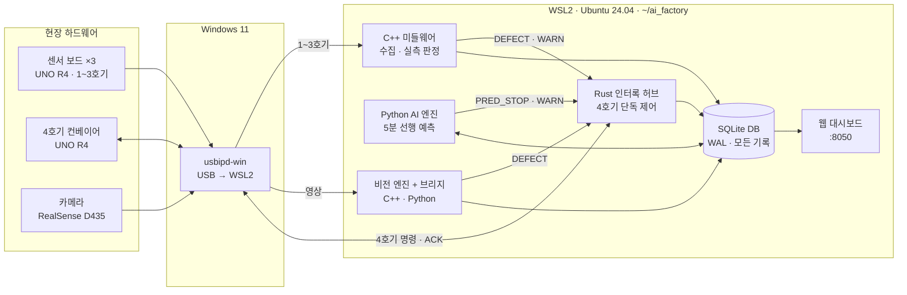

**정지 요청은 셋(실측·예측·영상), 권한은 하나(Rust 허브).** 안전 경로를 한 곳에 모아야 검증하고 책임질 수 있습니다.

### 4.2 4계층 구조

| 계층 | 역할 | 구성 요소 |
|---|---|---|
| ① 현장 | 측정과 구동만 (판정하지 않음) | 센서 보드 ×3 · 4호기 컨베이어(모터·에어 퇴출·경고등) · RealSense D435 |
| ② 수집·판정 | 규칙대로 즉시 판정 | C++ 미들웨어 · C++ 비전 엔진 · 비전 브리지 |
| ③ 예측·제어 | 예측과 단독 제어 | Python AI 엔진 · **Rust 인터록 허브** · 작업자 명령(RESET·STOP·STATUS) |
| ④ 기록·표시 | 모두 기록하고 표시 | SQLite DB · 웹 대시보드 · MES/다른 PC(읽기 전용 API) |

데이터는 아래에서 위로 올라가고, 정지 명령은 오직 허브를 거쳐 아래로 내려갑니다. 비전 모델을 v2 → v6, PatchCore로 여러 번 바꾸는 동안 **허브와 미들웨어 코드는 한 줄도 고치지 않았습니다.**

### 4.3 설계 원칙 6가지

| 설계 원칙 | 구현 | 코드 위치 |
|---|---|---|
| **제어 권한은 하나** | 4호기 포트는 Rust 허브만 열고, 나머지는 소켓으로 '요청'만 | `interlock_hub/src/main.rs` |
| **고장 나면 멈춘다** (fail-safe) | 미들웨어 생존 신호 5초 단절 → 라인 정지, 재가동은 작업자만 | `watchdog_loop()` |
| **빠짐없음을 숫자로** | 모든 줄에 일련번호 + 체크섬 → 누락·손상 건수 10초마다 기록 | `BaseEquipment.h` |
| **기준은 한 곳에서** | C++ `Spec` · Python `config` 같은 값, 경계 조건도 기준표 그대로 | `Common.h` · `config.py` |
| **느슨한 연결** | 프로그램끼리는 DB와 소켓으로만 대화 → 하나가 죽어도 나머지 동작 | 6개 프로세스 전체 |
| **모든 결정은 기록** | 판정·예측·명령·결과·응답 시간을 DB에 남겨 사후 추적 | `tb_interlock_event` 외 |

### 4.4 실행 프로그램 6개

| 프로그램 | 언어 | 실행 (순서) | 입력 → 출력 | 내부 구성 |
|---|---|---|---|---|
| **인터록 허브** | Rust | ① `run_hub.sh` | 소켓 요청 → 4호기 명령 · 이력 기록 | 접속 처리 · 컨베이어 I/O · DB 기록 · 워치독 |
| **미들웨어** | C++ | ② `run_middleware.sh` | 1~3호기 시리얼 → 측정값 DB · 허브 알림 | 수집 ×3 · 허브 전송 · DB 기록 |
| **AI 엔진** | Python · PyTorch | ③ `run_ai.sh` | DB 측정값 → 예측 DB · 허브 정지 요청 | 1초 주기 루프 (예측 + 학습) |
| **대시보드** | Python · JS | ④ `run_dashboard.sh` | DB(읽기 전용) · 허브 상태 → 웹 :8050 | 요청마다 스레드 |
| **비전 엔진** | C++ · OpenVINO | ⑤ `run_vision.sh` | 카메라 → 판정 이벤트 `@@EVENT` | 촬영 · 추론 루프 |
| **비전 브리지** | Python | ⑤와 함께 | 이벤트 → DB · 허브 불량 요청 | 엔진 출력 읽기 · 자동 재시작 |

**실행 순서의 이유**

1. **허브** — 정지 요청을 받을 곳이 먼저 있어야 함. 기동 1.5초 뒤 PING으로 4호기 상태 동기화
2. **미들웨어** — 1~3호기 수집 시작, 1초마다 허브에 생존 신호(HEARTBEAT)
3. **AI 엔진** — DB에서 최근 17분을 읽어 이어서 예측 (입력 10분이 쌓여야 첫 유효 예측)
4. **대시보드** — 읽기 전용이라 언제 켜고 꺼도 무관
5. **비전** — 기본은 기록만 하는 SHADOW 모드, `--live` 일 때만 허브로 불량 요청

모든 실행 스크립트는 시작 전에 `_common.sh` 로 **설정 파일 존재 · 예시 포트값 · 장치 권한 · 중복 실행(flock) · 빌드 여부**를 자동 점검합니다.

---

## 5. 데이터 수집: 센서 → 미들웨어

### 5.1 한 줄 프로토콜 (115200bps)

```
[FORGING],123456,50.12,0.0213*5A
 └─태그─┘ └seq─┘ └값1┘ └─값2─┘ └XOR 체크섬 ('*' 앞 모든 바이트의 XOR)
```

| 보드 | 출력 주기 | 값 1 | 값 2 | 시험용 정답 줄 |
|---|---|---|---|---|
| 1호기 압조 | **1초에 1024줄** (샘플마다) | 압력 (ton) | 진동 원시값 | `[FORGING_SIM]` 1초마다 |
| 2호기 전조 | 부품 1개마다 (0.8초) | 금형 변위 (mm) | 초음파 AE (dB) | `[ROLLING_SIM]` 1초마다 |
| 3호기 열처리 | 2초마다 | 노내 온도 (℃) | 탄소 농도 (기록만) | `[HEAT_SIM]` 1초마다 |
| 4호기 컨베이어 | 1초마다 상태 보고 | 라인 상태 | 경고등 · 퇴출 수 | — (명령은 허브 → 4호기) |

> `*_SIM` 줄은 가상 센서가 진행 중인 고장과 손상도를 알려 주는 **평가 전용 정답**입니다. 이 덕분에 AI가 고장을 몇 분 먼저 잡았는지 정확히 측정할 수 있었습니다. (실설비에는 없음)

### 5.2 수신 검사: 누락과 손상을 세는 법

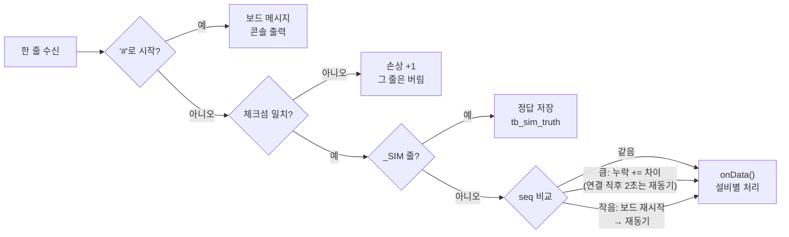

10초마다 **수신 · 누락 · 손상 · 재동기** 건수를 `tb_link_stats` 에 저장 → '빠짐없이 수집'을 숫자로 증명 (**117만 샘플 누락 0**).

### 5.3 미들웨어 내부: 스레드 5개, 큐 2개

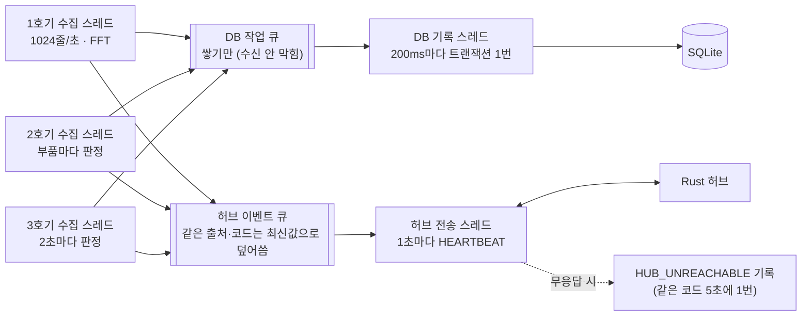

수집 스레드는 DB 저장이나 허브 통신을 **직접 하지 않고 큐에 넣기만** 합니다. 1초에 1024줄이 들어오는 1호기에서 저장을 기다리면 시리얼 버퍼가 넘쳐 데이터가 빠지기 때문입니다.

### 5.4 1호기 1초 처리: 샘플 1024개 → 대역 RMS 1개

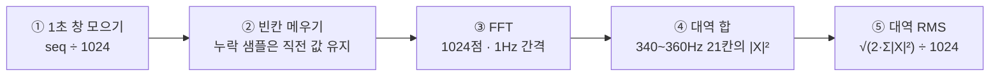

| 판정 (1초마다) | 보류 규칙 | 저장 (1초에 1행) |
|---|---|---|
| 압력 평균 < 48 · > 52 → 불량<br/>RMS ≥ 0.8 → 불량 (정지 후 퇴출)<br/>0.4 ≤ RMS < 0.8 → 경고등 | 누락 103개(10%) 이상 → `DATA_LOSS`, 판정 안 함<br/>연결 직후 중간부터 시작한 창은 버림 | 압력 평균·최소·최대, 대역 RMS<br/>샘플 수 · 누락 수 · 첫 seq<br/>선택: 원시 파형 4KB |

> 제곱합의 제곱근이므로 대역 RMS는 **구조적으로 0 이상**입니다.

---

## 6. 안전 인터록: Rust 허브와 4호기

### 6.1 프로그램 간 메시지: JSON 한 줄 요청, 한 줄 응답 (Unix 소켓)

```jsonc
// 요청: AI 엔진 → 허브
{"src":"AI_EQ_FORGING_01","kind":"PRED_STOP","code":"PRED_NG_VIBE_CRITICAL",
 "value":0.83,"detail":"5분 뒤 350Hz 대역 RMS P50=0.83 ..."}

// 응답: 허브 → AI 엔진 (4호기 ACK 수신 후)
{"ok":true,"result":"ACKED(STOPPING)","line_state":"STOPPING","warn_lamp":false,
 "cmd_id":17,"eject_count":3}
```

| 보내는 곳 | src | 응답 대기 |
|---|---|---|
| 미들웨어 | `MIDDLEWARE` | 1초 |
| AI 엔진 | `AI_EQ_…` | 2초 |
| 비전 브리지 | `VISION_…` | 2초 |
| 대시보드 | `DASHBOARD` | 0.5초 |
| 작업자 CLI | `OPERATOR` | 5초 |

**Unix 소켓을 쓴 이유**: 같은 PC 안에서만 통신 → 네트워크로 라인을 움직일 수 없음 · 파일 경로로 접속 · JSON 한 줄이라 C++/Rust/Python/Bash 어디서든 구현.

### 6.2 허브 내부: 포트는 스레드 하나만 만진다

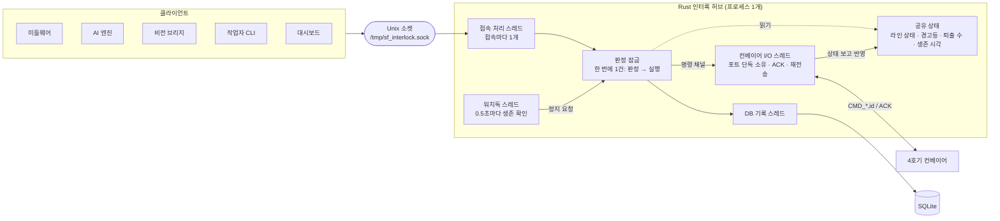

미들웨어와 비전이 같은 순간에 불량을 보내도 **판정 잠금** 때문에 첫 요청만 실행되고 두 번째는 이미 정지 중인 것을 보고 중복 실행하지 않습니다 → **퇴출이 두 번 되지 않음**.

### 6.3 허브 판정표와 워치독

| 요청 (kind) | 보내는 곳 | 라인 가동 중일 때 | 이미 정지·경고 중일 때 |
|---|---|---|---|
| `DEFECT` | 미들웨어 · 비전 | `CMD_DEFECT` → 정지 후 퇴출 | 무시하고 건수만 집계 |
| `PRED_STOP` | AI 엔진 · 워치독 | `CMD_STOP` → 정지 (퇴출 없음) | 무시하고 건수만 집계 |
| `WARN` | 미들웨어 · AI 엔진 | 경고등이 꺼져 있으면 `CMD_WARN` | 경고등이 켜져 있으면 무시 |
| `RESET` | **작업자(OPERATOR)만** | `CMD_RESET` → 재가동, 경고등 소등 | 다른 출처면 거부 (`REJECTED_NOT_OPERATOR`) |
| `HEARTBEAT` | 미들웨어 · AI 엔진 | 생존 시각 갱신 | — |
| `STATUS` | 대시보드 · 작업자 | 현재 라인 상태 응답 | — |

| 워치독 | 동작 | 이유 |
|---|---|---|
| 미들웨어 5초 단절 | **라인 정지 (fail-safe)** | 실측 판정이 멈춘 상태로 가동 금지 |
| AI 엔진 10초 단절 | 경보만 기록 | 예측 보호만 잃고 실측 판정·정지는 계속 동작 |
| 4호기 상태 보고 3초 단절 | 경보 기록 | 명령 전달 여부 불명 → 현장 확인 |

> 위험 경고등은 **작업자 RESET으로만 꺼집니다** (값이 내려가도 자동 소등 안 함 → 작업자가 경고를 놓치지 않도록).

### 6.4 4호기 컨베이어: 상태 기계

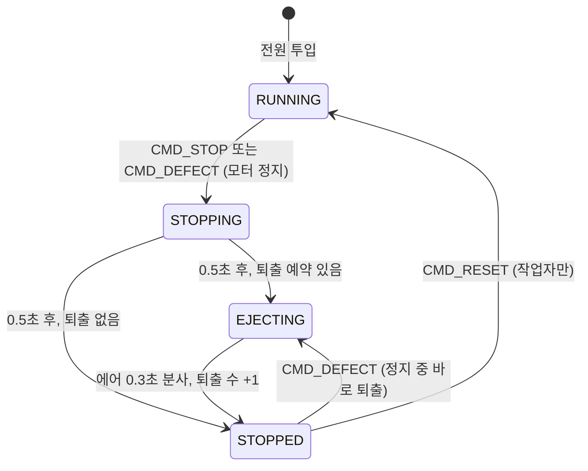

- `STOPPING` · `EJECTING` 중 RESET → `NAK BUSY_EJECTING` (거부)
- 1초마다 상태 보고: `[CONVEYOR],812,STOPPED,0,3*CS`

### 6.5 ACK · 재전송 · 멱등성

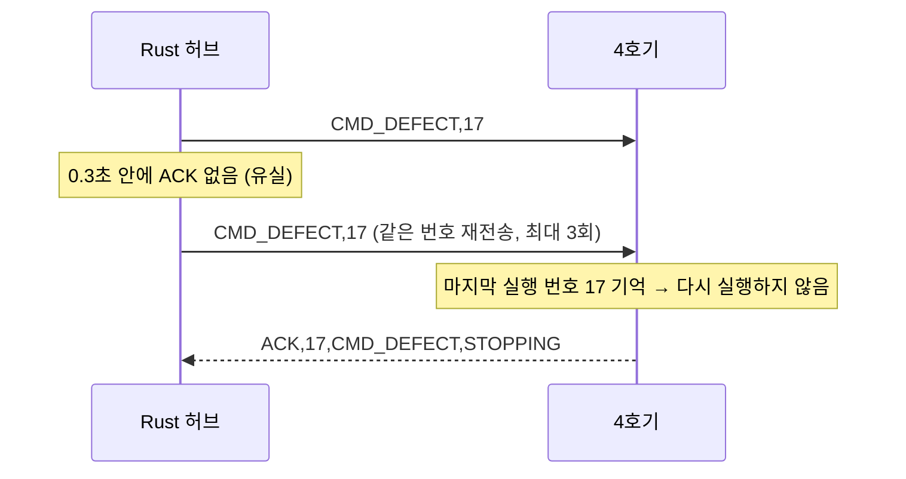

ACK만 유실되고 명령은 이미 실행됐을 수 있으므로, 4호기는 **같은 번호를 두 번 실행하지 않고 ACK만 다시 보냅니다** → 재전송 때문에 퇴출이 중복되지 않음.

---

## 7. 불량 판정 기준표

| 설비 | 항목 | 불량 조건 | 조치 |
|---|---|---|---|
| 1호기 압조 | 압력 (ton) | < 48 압력 낮음 · > 52 압력 높음 | 라인정지 후 퇴출 |
| 1호기 압조 | 350Hz 대역 RMS | 0.4 이상 0.8 미만 위험 경고 | 경고등 (가동 유지) |
| 1호기 압조 | 350Hz 대역 RMS | 0.8 이상 설비 파손 위험 | 라인정지 후 퇴출 |
| 2호기 전조 | 금형 변위 (mm) | < 3.95 미성형 · > 4.05 과성형 | 라인정지 후 퇴출 |
| 2호기 전조 | 초음파 AE (dB) | > 40 초음파 불량 | 라인정지 후 퇴출 |
| 3호기 열처리 | 온도 (℃) | < 830 온도 드랍 · > 870 과온도 | 라인정지 후 퇴출 |
| 3호기 열처리 | 탄소 농도 | 판정 없음 | 기록만 |
| AI 예측 | 압력·RMS·변위·온도 | 5분 뒤 불량 예측 | 라인정지 |
| 비전 | 영상 판정 | NG (신뢰도 0.5 이상) | 라인정지 후 퇴출 |

### 가상 센서: 고장은 서서히, 그리고 가속

| 설비 | 열화 시나리오 |
|---|---|
| 1호기 압조 | 금형 균열(`DIE_CRACK`) · 유압 누유(`HYD_LEAK`) · 밸브 고착(`VALVE_STICK`) |
| 2호기 전조 | 다이스 마모(`DIE_WEAR`) · 열팽창(`THERMAL_GROWTH`) · 다이 치핑(`TOOL_CHIP`) |
| 3호기 열처리 | 히터 열화(`HEATER_AGING`) · 열전대 드리프트(`TC_DRIFT`) |

손상도 `D(t) = (경과/TTF)^shape` (shape > 1: 처음엔 느리고 고장 직전 가속). 진행 속도도 ±30% 흔들려 매번 다르게 진행하며, **정비(`REPAIR`) 전까지 저절로 낫지 않습니다.** 명령 한 줄(`SCN <시나리오> <TTF분>`)로 원하는 고장을 원하는 시점에 시험할 수 있습니다.

---

## 8. AI 예지보전 엔진

### 8.1 한눈에: 10분을 보고, 5분 뒤를 범위로

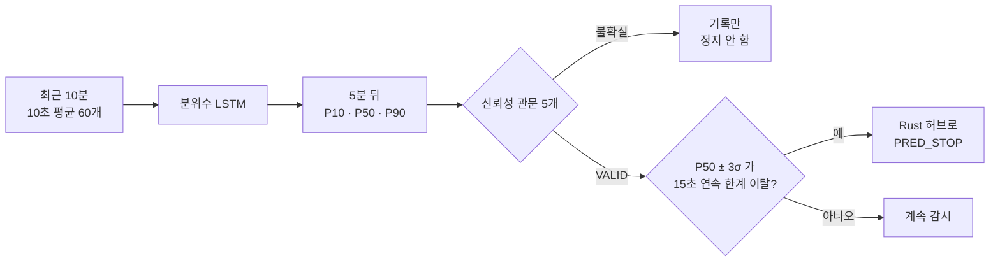

- **AI는 예측만 합니다.** 라인 정지 여부는 고정된 규칙(P50±3σ, 15초)과 Rust 허브가 결정 → '왜 세웠나'를 항상 숫자로 설명할 수 있습니다.
- **현장에서 계속 배웁니다.** 5분 전 예측의 정답(지금 실측)으로 10초마다 학습. 정상만 보고 '항상 괜찮다'고 믿지 않도록 합성 고장 데이터를 절반씩 섞습니다.
- **강화학습이 아닌 지도학습**입니다. 5분 뒤 실측이라는 정답이 있습니다.

### 8.2 문제 정의

| 예측 대상 | 단위 | 정규화 (중심 · 척도) | 기준표 한계 → 정규화 값 |
|---|---|---|---|
| 1호기 350Hz 대역 RMS | RMS | 0 · 0.8 | 0.8 → +1 (경고 0.4 → +0.5) |
| 1호기 압력 | ton | 50 · 2 | 48 → −1, 52 → +1 |
| 2호기 금형 변위 | mm | 4.0 · 0.05 | 3.95 → −1, 4.05 → +1 |
| 3호기 노내 온도 | ℃ | 850 · 20 | 830 → −1, 870 → +1 |

기준표 한계가 ±1이 되도록 정규화해 **단위가 다른 네 항목을 같은 모델 구조로** 다룹니다. (초음파 AE는 규칙 판정만, 탄소 농도는 기록만 → 예측 대상 제외)

### 8.3 모델 구조: 분위수 LSTM (파라미터 3.1만 개)

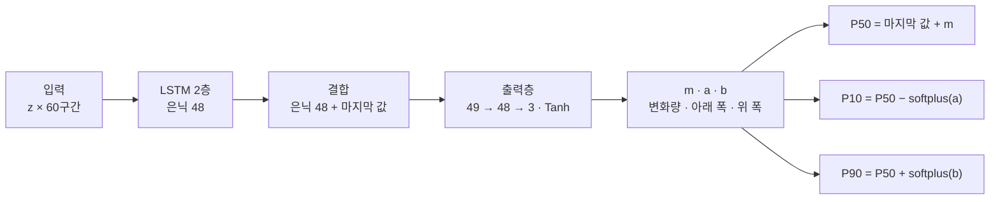

| 설계 | 효과 |
|---|---|
| 값이 아니라 **변화량**을 예측 | 수준이 달라도 일반화 |
| 아래·위 폭을 softplus(>0)로 | **P10 ≤ P50 ≤ P90 항상 성립** (구조적 보장) |
| 손실: pinball loss `max(q·(y−ŷ), (q−1)·(y−ŷ))`, q = 0.1·0.5·0.9 | 세 분위수를 동시에 학습 |
| 진동 RMS는 세 출력에 softplus(β=12) 변환 | **음수 예측 불가** (후처리 자르기가 아니라 모델 구조로 보장) |
| 2층 · 은닉 48 · 3.1만 파라미터 | **GPU 없이 CPU로 1초마다 4개 항목 예측** |

> **LSTM 직관**: 노트를 들고 10초 평균 60개를 차례로 읽는 사람. 망각 문은 잡음을 지우고, 입력 문은 '압력 하강 시작' 같은 신호를 적고, 출력 문은 '하강이 빨라지는 중'이라는 요약을 예측에 씁니다.

### 8.4 학습 전략: 합성 사전학습 + 현장 온라인 학습

| ① 합성 데이터 사전학습 | ② 현장 온라인 학습 |
|---|---|
| 시계열 40,000개 학습 · 4,000개 검증 · 6 epoch | 10초마다: 5분 전 입력 → 지금 실측으로 1스텝 학습 |
| 열화 발생 75%, 고장까지 3~50분, 가속 지수 0.8~3 | 미니배치 = **현장 16 + 합성 16** (망각 방지) |
| 진행 속도 흔들림 · 노이즈 · 정비 복귀 15% 무작위 | Adam 3e-4 · 리플레이 3,000개 |
| 모델 2종: 양방향(압력·변위·온도), 에너지(진동 RMS) | 10분마다 체크포인트 저장 → 재시작해도 이어서 |

| 사전학습 검증 (정규화 단위) | AI 오차 (MAE) | 현재값 유지 오차 | P10~P90 적중 |
|---|---|---|---|
| 양방향 모델 (압력 · 변위 · 온도) | **0.167** | 0.196 | 80% |
| 에너지 모델 (진동 RMS) | **0.066** | 0.101 | 82% |

현장은 고장이 드물어 고장 데이터를 기다릴 수 없으므로, '서서히 나빠지다 가속하는' **열화 모양**을 수만 개 만들어 먼저 가르쳤습니다. 특정 시뮬레이터 수식을 베끼지 않고 모양을 다양하게 만든 것이 핵심입니다.

### 8.5 신뢰성 설계: 라인을 세우기 전 통과해야 할 관문

| # | 관문 | 실패 시 상태 |
|---|---|---|
| 1 | 이력 10분 이상 | `INSUFFICIENT_HISTORY` |
| 2 | 입력 공백 20% 이하 | `DATA_GAP` |
| 3 | 최신 데이터 5초 이내 | `DATA_STALE` |
| 4 | 유한값 · 물리 범위 | `NON_FINITE` · `OUT_OF_PHYSICAL_RANGE` |
| 5 | 불확실성 폭(P90−P10) ≤ 규격 반폭 | `LOW_CONFIDENCE` |

**VALID 예측만** P50±3σ 가 한계를 **15초 연속** 넘을 때 라인 정지. AI는 목표 시각이 지난 예측을 실측과 **매분 대조**해 자기 성능(MAE, P10~P90 적중률)을 `tb_model_health` 에 기록합니다.

### 8.6 정지 판단: 왜 평균 ± 3σ, 왜 15초

- **왜 ±3σ인가** — 실측 판정은 부품 하나, 1초 하나 단위입니다. 평균이 한계에 닿기 전에 흩어진 개별 값이 먼저 넘으므로 흩어짐까지 봐야 늦지 않습니다. 평균만 볼 때 2호기에서 **최대 10분 늦던 문제를 해결**했습니다.
- **왜 15초 연속인가** — 한두 번 튀는 예측으로는 라인을 세우지 않습니다. → **정상 운전 8시간 오경보 0건**

### 8.7 평가 결과: 시나리오별 선행 시간

**평가 방법**: ① 실제 펌웨어 코드를 PC에서 가상시간으로 실행 → ② 미들웨어와 같은 FFT RMS 계산 → ③ 실시간 엔진과 같은 코드로 재생(온라인 학습 포함) → ④ 실측 첫 불량 시각과 AI 정지 시각 비교. 열화 7종 × 고장예상시간(TTF) 15·30·45분 = **21건**.

| 시나리오 | 항목 | TTF 15분 | TTF 30분 | TTF 45분 |
|---|---|---|---|---|
| 금형 균열 `DIE_CRACK` | 진동 RMS | +4.0분 | +3.6분 | +4.7분 |
| 유압 누유 `HYD_LEAK` | 압력 | +2.6분 | +6.3분 | +6.4분 |
| 밸브 고착 `VALVE_STICK` | 압력 | +2.5분 | +4.5분 | +2.4분 |
| 다이스 마모 `DIE_WEAR` | 변위 | +0.0분 (+2초) | +1.4분 | +6.8분 |
| 금형 열팽창 `THERMAL_GROWTH` | 변위 | +2.5분 | +1.8분 | +2.2분 |
| 히터 열화 `HEATER_AGING` | 온도 | +0.7분 | +1.7분 | **−8초** |
| 열전대 드리프트 `TC_DRIFT` | 온도 | +3.7분 | +9.7분 | +14.6분 |

> **+ = AI가 실측 불량보다 먼저 정지.** 20/21건 선행, **중앙값 2.6분**, 범위 −8초 ~ +14.6분. 열화가 느릴수록 선행 시간이 길어지는 경향.

| 정상 운전 (오경보 시험) | 시간 | 라인정지 오경보 | 경고 오경보 | P10~P90 적중 |
|---|---|---|---|---|
| 1호기 진동 RMS · 압력 | 2h | 0 | 0 | 100% · 89% |
| 2호기 변위 | 3h | 0 | 0 | 97% |
| 3호기 온도 | 3h | 0 | 0 | 95% |

**실보드 운전 예측 품질**

| 지표 | 값 |
|---|---|
| 정상 구간 · 1호기 압력 | AI 오차 0.240 vs 현재값 유지 0.280 → **14% 작음** (416건) |
| 고장 지속 구간 · 유압 누유 | AI 오차 0.375 vs 0.498 → **25% 작음** (924건) |
| P10~P90 안에 실측이 든 비율 | **77~81%** (목표 80%) |
| 실보드 라인 정지 | 유압 누유 시험에서 AI 예측으로 정지 요청 → 4호기 ACK **1ms** |

### 8.8 AI 엔진 내부: 1초 루프 한 바퀴

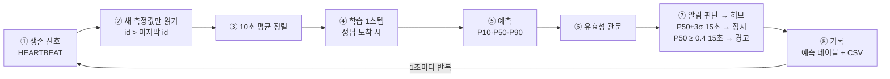

주기 작업: 60초마다 성능 기록(`tb_model_health`) · 600초마다 모델 저장 · 최초 실행 시 사전학습 모델 자동 생성.

### 8.9 자주 묻는 질문

| 질문 | 답 |
|---|---|
| 강화학습인가요? | 아니요. 5분 뒤 실측이라는 정답이 있는 **지도학습**입니다. AI는 행동을 고르지 않고 예측만 합니다. |
| 왜 LSTM인가요? | 고장은 처음엔 느리다가 막판에 가속합니다. 이런 흐름을 기억하는 데 맞고, 작고 빠릅니다. |
| GPU가 필요한가요? | 아니요. 파라미터 3.1만 개라 CPU로 1초마다 4개 항목을 충분히 예측합니다. |
| 재시작하면 학습이 사라지나요? | 아니요. 10분마다 저장하고 시작할 때 이어서 불러옵니다. |
| 왜 5분 예측인데 선행은 2.6분인가요? | 오경보를 막는 확인 조건(15초 연속, 좁은 불확실성 폭)이 고장 직전 가속 구간에서 시간을 소모하기 때문입니다. |
| 못 잡는 고장도 있나요? | 센서에 흔적이 없는 고장입니다. 히터 열화는 온도 제어기가 숨겨 8초 늦었고, 전류 센서로 개선할 수 있습니다. |

---

## 9. AI 비전 검사

### 9.1 비전 파이프라인: 촬영부터 퇴출까지

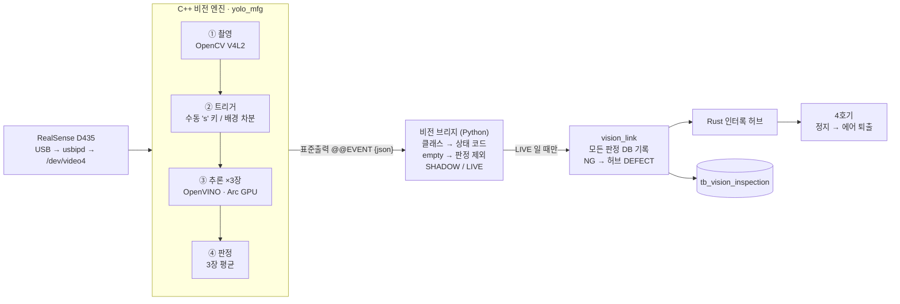

엔진과 연동을 나눈 덕분에 **다른 엔진(PatchCore 등)으로 바꿔도 같은 `@@EVENT` 형식만 출력하면** 브리지·허브·DB는 그대로 씁니다.

### 9.2 비전 개선 과정: 여섯 번의 고비

| 단계 | 시도 | 결과 |
|---|---|---|
| 1 | 첫 모델 (YOLO11n-cls, 5클래스) | 정답 사진 27장 100% — 그런데 현장에서 양품 판정이 약함 |
| 2 | 판정 멈춤 · 빈 화면 판정 | NG 뒤 다음 부품을 안 봄, 아무것도 없는데 판정하기도 |
| 3 | 색 혼동 | 검정·메탈·흰색이 흔들림 → 테이프를 파랑·노랑으로 변경 (v4·v5) |
| 4 | 양품 추가 재학습 | 양품 확신이 오히려 하락 (0.863 → 0.760), 교체 보류 |
| 5 | PatchCore 시도 | 집에서 AUROC 1.0, 현장 WSL 화면에선 양품도 NG |
| 6 | **v6 + 수동 판정** | empty 클래스 · 's' 키 판정 → **현장 판정 성공** |

### 9.3 문제 · 원인 · 해결

| 겪은 문제 | 원인 | 해결 · 현재 |
|---|---|---|
| 양품인데 NG | 한 모델이 색과 양품 중 하나만 고름 | 현장 사진·양품 보강해 재학습 (v6) |
| NG 뒤 판정 고정 | 자동 노출·화이트밸런스로 배경이 바뀜 | 배경 재학습(`b` 키), 수동 판정 |
| 빈 화면도 판정 | 모델에 '없음'이라는 답이 없음 | `empty` 클래스 + 판정 제외 처리 |
| 빠른 물체 놓침 | 화면 변화가 3장 연속 보여야 판정 | 60fps 설정, 장기: 광전 센서 |
| 검정·메탈·흰색 흔들림 | 밝기로만 구분되는 색 | 테이프를 파랑·노랑으로 변경 |
| PatchCore 현장 실패 | 학습은 Windows 카메라 앱, 현장은 WSL | **WSL에서 재촬영 후 재학습 (아래 업데이트)** |
| 애매한 양품이 라인 못 세움 | 신뢰도 0.5 미만 NG는 허브에 안 보냄 | 운영 정책 결정 필요 |

### 9.4 비전에서 배운 것

1. **학습 조건 = 운영 조건** — 같은 카메라, 같은 프로그램, 같은 설정으로 찍은 사진으로 학습
2. **모델보다 촬영 조건이 먼저** — 조명·노출·화이트밸런스 고정이 정확도를 좌우
3. **질문을 나눠라** — 색 구분과 양품 여부는 다른 질문. 단순한 색 규칙과 AI를 함께
4. **시험 사진이 적으면 100%도 믿지 마라** — 27장 100%였던 모델이 현장에서 흔들림
5. **추측하는 감지에는 한계가 있다** — 화면 변화 대신 센서로 부품 도착을 확인
6. **정책은 코드 끝까지 일관되게** — '애매하면 불량' 원칙이 중간 단계에서 끊기지 않게

### 9.5 발표 이후 업데이트 (2026-10-08): PatchCore 현장 재학습 + C++ 엔진 통합

교훈 1번(학습 조건 = 운영 조건)을 그대로 적용해 **현장 WSL 카메라 경로로 사진을 다시 찍고, 현장 PC(CPU)에서 바로 학습**했습니다.

| 항목 | 내용 |
|---|---|
| 학습 데이터 | 현장 WSL 촬영 양품 60장 (학습) · 양품 10장 + 불량 38장 (시험) |
| 학습 | anomalib 2.6 PatchCore (wide_resnet50_2, coreset 10%) · **CPU 67초** |
| 시험 결과 | **AUROC 1.0 · F1 1.0** — 양품 최고 0.408 / 불량 최저 0.515 (파랑) |
| 새 사진 검증 | 학습에 안 쓴 15장 **전부 정답** (양품 0.30~0.38, 불량 0.47~0.63) |
| 판정 규칙 | **PatchCore 점수 > 0.44 또는 색 덩어리 ≥ 260px → NG** (두 규칙이 서로 보완) |
| 통합 | 같은 C++ 엔진에 `task: "anomaly"` 추가 → 설정 파일만 바꾸면 YOLO ↔ PatchCore 전환 |
| 부가 기능 | 빈 화면 자동 제외(배경 학습) · NG 시 이상도 지도(`_map.jpg`) 저장 · 카메라 설정 자동 적용 |
| 상태 | 사진 기반 검증 완료, **현장 카메라 실시간 검증 진행 중** |

---

## 10. 데이터베이스

SQLite 파일 하나(WAL 모드)에 모든 기록이 모입니다. 외래 키 없이 **시각(KST)과 설비 ID**로 논리적으로 연결됩니다.

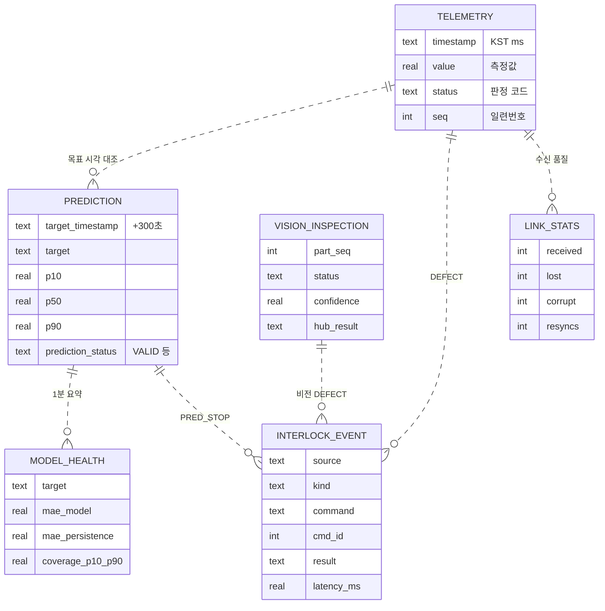

**DB 파일 하나, 테이블마다 주인 하나**

| 테이블 | 쓰는 프로그램 | 주기 | 내용 |
|---|---|---|---|
| `tb_forging_telemetry` | 미들웨어 | 1초 | 압력 평균·최소·최대 · 대역 RMS · 누락 수 |
| `tb_rolling_telemetry` | 미들웨어 | 부품마다 | 금형 변위 · 초음파 AE · 판정 |
| `tb_heat_telemetry` | 미들웨어 | 2초 | 노내 온도 · 탄소 농도 · 판정 |
| `tb_link_stats` | 미들웨어 | 10초 | 수신 · 누락 · 손상 · 재동기 건수 |
| `tb_sim_truth` | 미들웨어 | 1초 | 시험용 실제 손상도 (평가 전용) |
| `tb_*_prediction` (3개) | AI 엔진 | 1초 | P10 · P50 · P90 · 유효 여부 · 사유 |
| `tb_model_health` | AI 엔진 | 60초 | MAE · P10~P90 적중률 · 학습 횟수 |
| `tb_interlock_event` | 허브 (+미들웨어) | 사건마다 | 요청 · 명령 · 번호 · 결과 · 응답 ms |
| `tb_vision_inspection` | 비전 (vision_link) | 부품마다 | 판정 · 신뢰도 · 모델 버전 · 허브 결과 |

한 테이블에 여러 프로그램이 쓰지 않으니 충돌이 없고, 문제가 생기면 어느 프로그램을 봐야 할지 바로 압니다. (예외: 허브가 죽으면 미들웨어가 `HUB_UNREACHABLE` 을 대신 기록)

---

## 11. 동작 시나리오와 장애 대응

### 11.1 시나리오: 금형 균열이 진행될 때

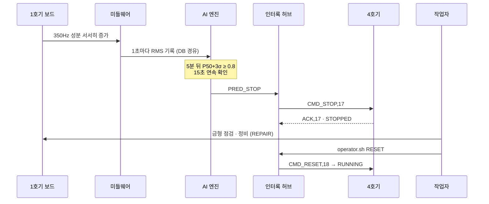

AI가 없었다면 RMS가 실제로 0.8에 도달한 순간 미들웨어가 `DEFECT` 를 보내 정지 후 퇴출했을 것입니다. **AI는 이 순간을 평균 2.6분 앞당겨 불량품이 나오기 전에 라인을 세웁니다.**

### 11.2 장애가 나면 어떻게 되나

| 장애 | 누가 어떻게 알아채나 | 시스템 동작 |
|---|---|---|
| **미들웨어 종료** | 허브: 생존 신호 5초 없음 | **라인 즉시 정지** (fail-safe), 작업자 RESET 전까지 유지 |
| **AI 엔진 종료** | 허브: 생존 신호 10초 없음 | 경보 기록, 실측 판정과 정지는 그대로 동작 |
| **센서 USB 끊김** | 미들웨어: 읽기 오류 | 1초마다 재연결, 연결 후 2초는 재동기 (누락으로 안 셈) |
| **4호기 끊김** | 허브: 상태 보고 3초 없음 · 포트 오류 | 경보 기록, 명령은 `NO_PORT` 로 남김 → 현장 수동 확인 |
| **ACK 유실** | 허브: 0.3초 무응답 | 같은 번호로 최대 3회 재전송, 4호기는 중복 실행 안 함 |
| **허브 종료** | 각 프로그램: 소켓 연결 실패 | `HUB_UNREACHABLE` 기록 · 화면 경고 ※ 4호기 자체 감시는 남은 과제 |
| **DB 지연 · 잠김** | SQLite busy_timeout | 최대 5초 대기, 미들웨어는 큐에 모았다가 한 번에 저장 |
| **카메라 끊김** | 비전 브리지: 엔진 비정상 종료 | 3초·6초… 최대 30초 간격으로 엔진 자동 재시작 |

---

## 12. 대시보드와 네트워크

### 대시보드: 예측과 실측을 한 화면에

| 위험 경고 (1호기 금형 균열 진행 중) | 라인 정지 (3호기 히터 열화 예측) |
|---|---|
|  |  |

- 실선 = 실측 10초 평균, **파란 점선 = 5분 전에 낸 예측 P50**, 파란 띠 = P10~P90, 빨간 선 = 기준표 한계
- 세로선 오른쪽 음영은 아직 오지 않은 5분 (미래 예측)
- 카드마다 AI 오차 vs 현재값 유지 오차, P10~P90 적중률, 유효 예측 비율을 실시간 표시

### 원격 접속과 MES 연동

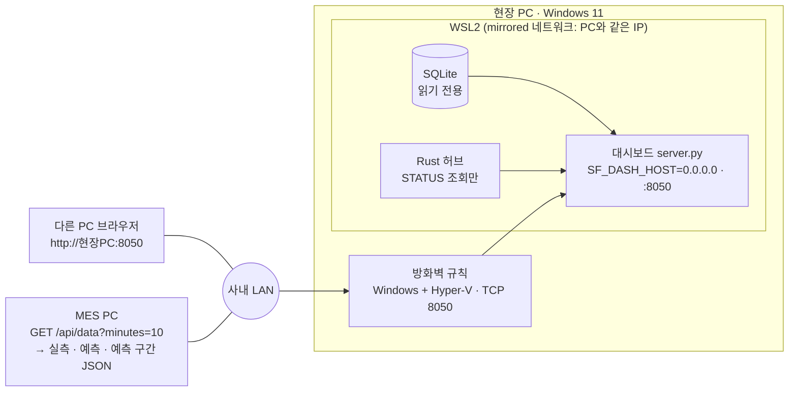

> **네트워크로는 조회만 가능합니다.** 정지·재가동 명령은 현장 PC 안의 Unix 소켓으로만 들어가므로, 사내 네트워크의 누구도 원격으로 라인을 움직일 수 없습니다.

---

## 13. 폴더 구조와 실행 방법

### 폴더 구조

```
ai_factory/
├─ arduino/        펌웨어 4개 (.ino) — 1~3호기 가상 센서, 4호기 컨베이어
├─ middleware/     C++ 수집 · 판정 (BaseEquipment, FFT, DatabaseManager, HubClient)
├─ interlock_hub/  Rust 인터록 허브 (Cargo)
├─ ai_pdm/         Python AI 엔진 · checkpoints/
├─ vision/         C++ 비전 엔진(yolo_engine) · 브리지 · models/ · config/
├─ dashboard/      웹 서버 · index.html · API.md
├─ scripts/        run_*.sh · env.sh · operator.sh · _common.sh
├─ tools/          sim/ (펌웨어 PC 시뮬레이터) · eval/ (AI 평가) · patchcore/
├─ data/           DB · 비전 기록
└─ docs/           개발자 가이드 · AI 평가 · 수정이력
```

### 빠른 시작

```bash
# 0) 최초 1회
sudo apt install -y build-essential libsqlite3-dev socat
curl --proto '=https' --tlsv1.2 -sSf https://sh.rustup.rs | sh    # Rust 1.80+

# 1) 설치 · 빌드
./install.sh                                  # 실행 중이면 거부, 바뀌는 파일은 _backup/ 에 보관
cp scripts/env.sh.example scripts/env.sh      # 포트를 /dev/serial/by-id 경로로 수정
./scripts/build_all.sh                        # C++ 미들웨어 · Rust 허브 · 시뮬레이터 · 비전 엔진

# 2) 실행 (터미널 각각, 이 순서대로)
./scripts/run_hub.sh            # ① Rust 인터록 허브
./scripts/run_middleware.sh     # ② C++ 미들웨어
./scripts/run_ai.sh             # ③ AI 엔진
./scripts/run_dashboard.sh      # ④ 대시보드 → http://localhost:8050
./vision/run_vision.sh          # ⑤ 비전 (SHADOW, 실제 연동은 --live)

# 3) 작업자 명령
./scripts/operator.sh STATUS | RESET | STOP
```

> 하드웨어 없이도 `tools/sim` 의 펌웨어 PC 시뮬레이터 + socat 가상 시리얼로 전체 시스템을 시험할 수 있습니다.

### 운영 견고화: 사람의 실수를 코드로 막기

| 기능 | 내용 |
|---|---|
| 중복 실행 차단 | 같은 프로그램을 두 번 실행하면 거부 (한 포트를 둘이 읽으면 데이터가 나뉘어 누락) |
| 설정 누락 사전 감지 | 예시 포트값 · 장치 없음 · 권한 문제를 시작 전에 안내 |
| 현장 설정 보존 설치 | 실행 중 거부 · 자동 백업 · `env.sh` · 모델 · DB는 덮어쓰지 않음 |
| 비전 장애 자동 복구 | 카메라 끊김 시 엔진 자동 재시작 |

---

## 14. 알려진 한계와 다음 단계

### 알려진 한계와 대응

| 한계 | 영향 | 대응 |
|---|---|---|
| 허브가 꺼지면 라인을 세울 주체가 없음 | 그 사이 불량 통과 가능 | 4호기 펌웨어 자체 워치독 (미구현, 최우선) |
| 허브 재시작 직후 명령 번호 중복 | 최대 약 1초 정지 지연 | 시작 번호 무작위화 (한 줄 수정) |
| 히터 열화는 AI 선행이 거의 없음 | 실측 판정에 의존 | 히터 전류 센서 추가 검토 |
| 재가동 직후 AI가 다시 정지시킬 수 있음 | 작업자 혼란 | 정비 후 3~5분 대기 절차 |
| 비전 판정은 현장 카메라 검증 중 | LIVE 시 오정지 위험 | 검증 통과 전까지 SHADOW 모드 |

### 다음 단계 (제안)

| 단기 | 중기 | 장기 |
|---|---|---|
| 허브 명령 번호 수정·재검증 | 4호기 자체 워치독 | 산업용 카메라 · 하드웨어(광전 센서) 트리거 |
| 카메라 노출 고정, ROI 지정 | 실설비 장기 운전으로 AI 재평가 | MES 연동 정식화 |
| PatchCore 현장 카메라 검증 | 비전 LIVE 전환 (검증 통과 시) | 이상 탐지 + 색 규칙 고도화 |

---

## 15. 참고

- **라이선스 주의**: 비전 모델 학습에 사용한 Ultralytics는 **AGPL-3.0**입니다. 사내 사용은 일반적으로 문제가 적지만, 외부 배포·판매 시에는 법무 확인이 필요합니다.
- **평가 데이터의 성격**: AI 평가는 가상 센서(실제 펌웨어 코드의 가상시간 실행)에 대한 결과입니다. 실설비 적용 전 `tb_model_health` 의 MAE와 적중률을 최소 수일간 확인한 뒤 라인 정지 권한을 운영에 반영하기를 권장합니다.
- **AI 개발 보조**: 개발 과정에서 Claude (Anthropic) · Gemini (Google)를 보조 도구로 사용했습니다.

---

<p align="center">
<b>가상 공정 AX Project</b> · 볼트·너트 라인 예지보전 프로젝트<br/>
이민하 · 2조 · 2026년 10월
</p>
