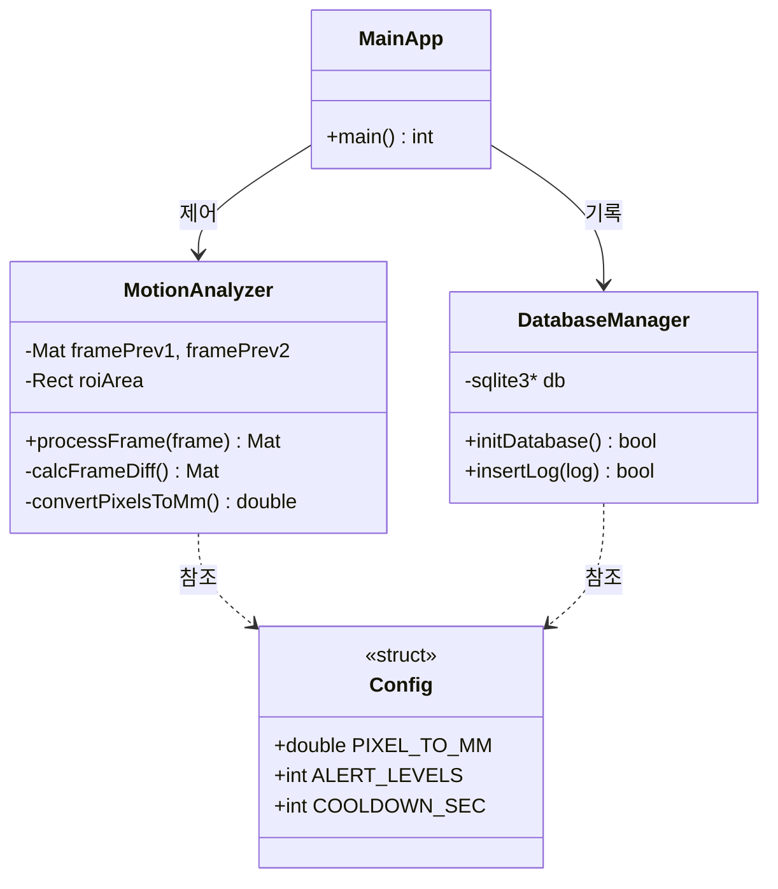
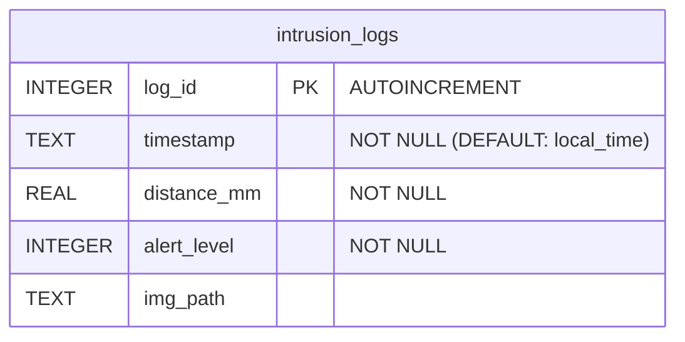

# 🛡️ Safety Motion Guard
### 실시간 안전 경계 침투 감지 및 DB 자동 저장 시스템

> OpenCV 기반의 **3-Frame 차분 알고리즘**을 활용하여 작업 공간 내 위험 구역 침투를 실시간 감지하고, 픽셀 단위 측정값을 mm 단위로 환산하여 SQLite DB 및 이미지 갤러리에 자동 저장하는 모듈형 안전 관리 시스템입니다.

---

## 🛠️ 1. 개발 환경 (Tech Stack)

| 구분 | 기술 스택 | 설명 |
| :--- | :--- | :--- |
| **Operating System** | Ubuntu | 개발 및 구동 환경 |
| **Language** | C++ | 고성능 실시간 영상 처리를 위한 메인 언어 |
| **Vision & Image** | OpenCV (`cv2`) | 영상 캡처, 3-Frame 차분 및 ROI 처리 |
| **Math & Data** | cmath | 픽셀-mm 환산 및 거리 계산 연산 |
| **Database** | SQLite3 | 침투 이력 로그 및 메타데이터 영구 저장 |

---

## 🔄 2. 개발 프로세스 (Work Process)

### 📌 2.1. 요구사양 협의
* **주제 선정**: 산업 현장 실시간 작업자 및 물체 경계선 침투 감지 시스템 개발 확정
* **핵심 요소 도출**: 
  * 픽셀-mm 변환 연산 정밀도 설정 (`0.264 mm/px`)
  * 관심 영역(ROI) 경계 설정 및 위험 단계별 색상 시각화 (`5mm / 10mm / 20mm`)
  * 알람 중복 방지를 위한 쿨다운 제어 로직 정의 (`2초`)

### 📐 2.2. 구조 설계
* **객체지향(OOP) 설계**: 역할별 독립 클래스 파일 모듈화 분리
* **프로세스 흐름 구축**: 3-Frame 차분 및 경보 캡처 처리 Flowchart 설계
* **DB 모델링**: SQLite 기반 침투 이력 로그 테이블 (`intrusion_logs`) 구조화

### 💻 2.3. 로직 구현
* **모듈별 구현**: `Config`, `MotionAnalyzer`, `DatabaseManager` 컴포넌트 독립 구현
* **통합 제어**: `MainApp`을 통한 실시간 프레임 스트림 제어 및 이벤트 핸들링

---

## 📊 3. 시스템 설계 (Diagrams)

### 3.1. Class Diagram

### 3.2. Flow Chart

### 3.3 DataBase Modeling

---

## 🖥️ 4. 실습 

