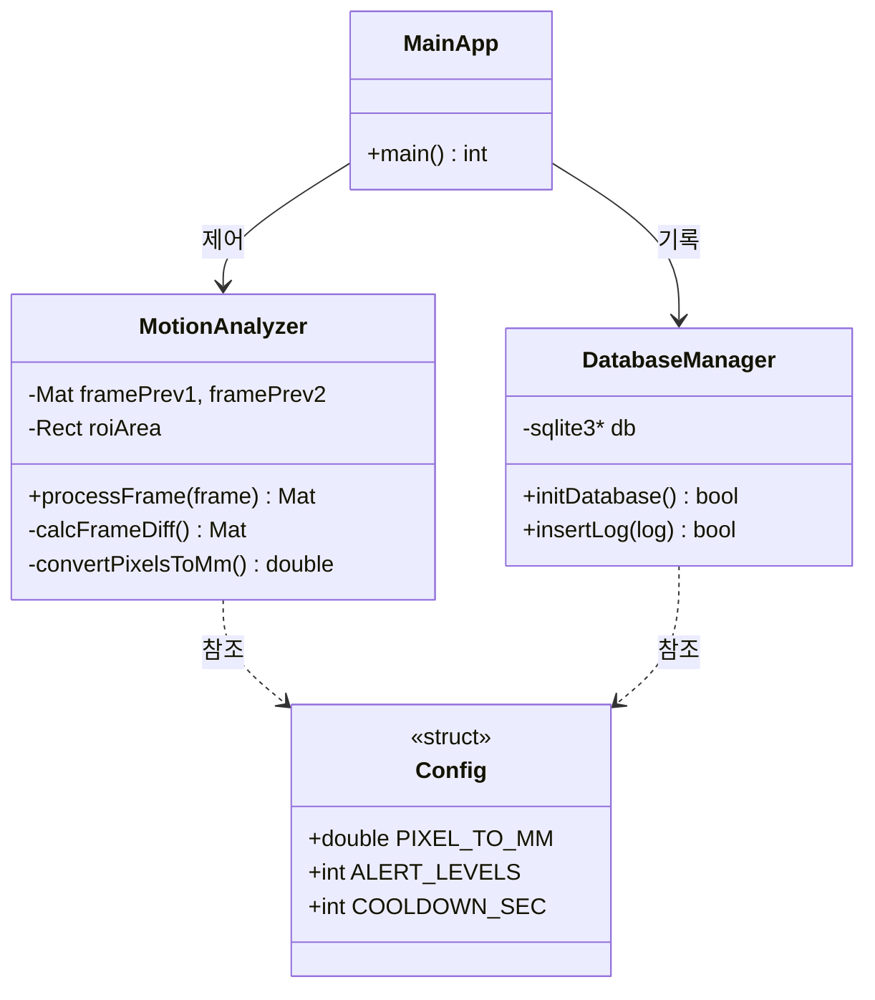
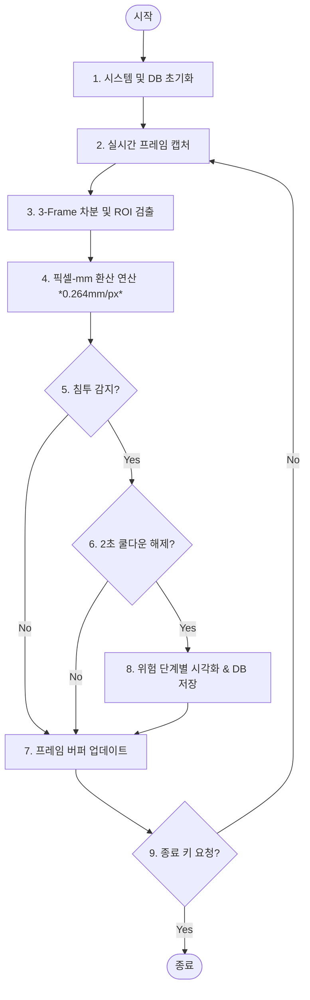

# 🛡️ 프로젝트명: 실시간 안전 경계 침투 감지 및 DB 저장 시스템 (Safety Motion Guard)

> OpenCV 기반의 3-Frame 차분 알고리즘을 활용하여 작업 공간 내 위험 구역 침투를 실시간 감지하고, 픽셀 단위 측정값을 mm 단위로 환산하여 SQLite DB 및 이미지 갤러리에 자동 저장하는 모듈형 안전 관리 시스템입니다.

---

## 🛠️ 1. 개발 환경 (Tech Stack)

| 구분 | 기술 스택 |
| :--- | :--- |
| **Operating System** | Ubuntu |
| **Language** | C++ |
| **Vision & Image** | OpenCV (`cv2`) |
| **Math & Data** | cmath |
| **Database** | SQLite3 |

---

## 🔄 2. Work Process

### 📌 2.1. 요구사양 협의
- **주제 선정**: 산업 현장 실시간 작업자/물체 경계선 침투 감지 시스템 개발 주제 확정
- **요소 도출**: 픽셀-mm 변환 연산(0.264 mm/px), ROI 경계 설정, 위험 단계별 색상 표시(5mm/10mm/20mm) 및 쿨다운 2초 제어 로직 정의

### 📐 2.2. 구조 설계
- **클래스 설계**: 객체지향(OOP) 기반 모듈화 
- **흐름도 작성**: 3-Frame 차분 및 경보 캡처 처리 Flowchart 작성
- **DB 모델링**: SQLite 기반 침투 이력 로그(`intrusion_logs`) 데이터베이스 테이블 모델링

### 💻 2.3. 로직 구현
- **클래스 구현**: 역할별 독립 클래스 파일 모듈화 분리
- **메인 로직**: Main 실행 

---

## 📊 3. 시스템 설계 (Diagrams)

### 3.1. Class Diagram



### 3.2. Flow Chart


### 3.3 DataBase Modeling
erDiagram
    intrusion_logs {
        INTEGER log_id PK "AUTOINCREMENT"
        TEXT timestamp "NOT NULL (DEFAULT: local_time)"
        REAL distance_mm "NOT NULL"
        INTEGER alert_level "NOT NULL"
        TEXT img_path
    }
```
---

## 🖥️ 4. 실습 


